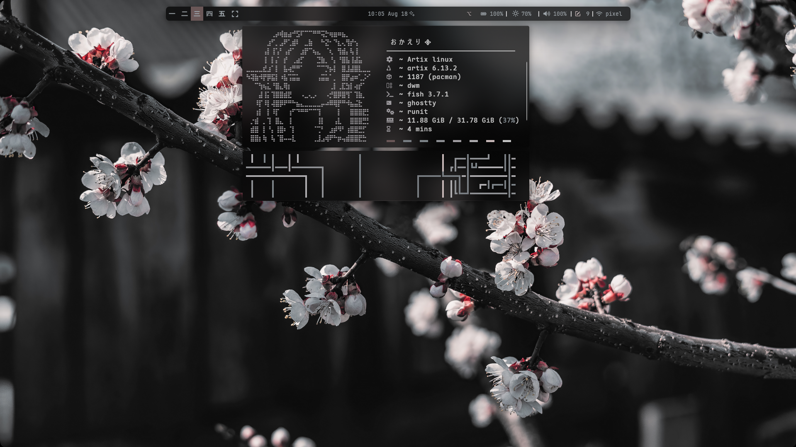
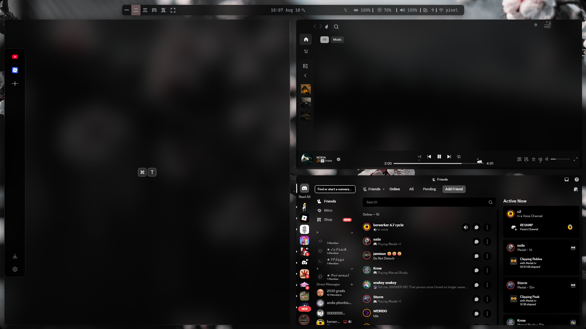
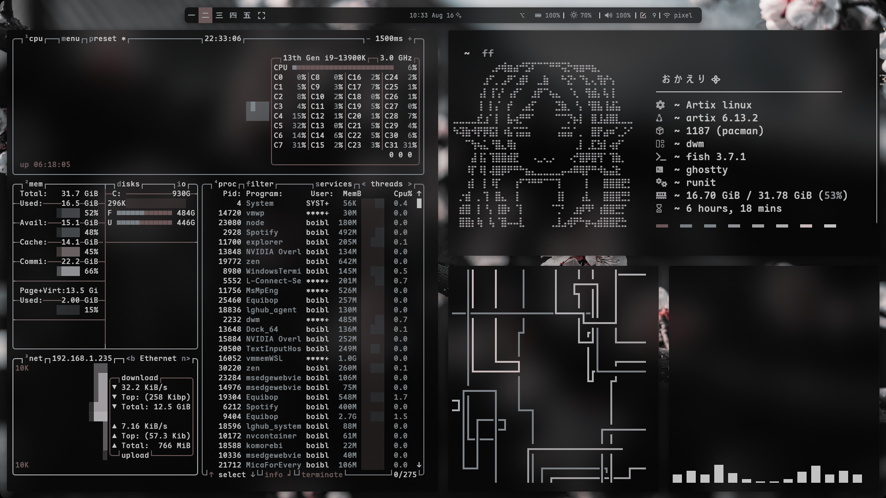

# HyprBlossom 🌸

here are all my windows 11 configs split nicely for reuse meant to mimic hyprland

wallpaper: <a href="https://files.catbox.moe/v6c4z4.png">Here</a>

wallpaper dir: C:\Users\boibl\Pictures\wallpapers

Zen Browser theme: <a href="https://github.com/allecsc/Altover">Altover</a>

discord client: <a href="https://github.com/Equicord/Equibop">Equibop</a>

themes dir: C:\Users\boibl\AppData\Roaming\equibop\themes

vscode profile: <a href="https://vscode.dev/profile/github/77306e445ac5046840a67e5f9e9b8976">Profile</a>

    
<h1 align="center">DE</h1>

    

    
<h1 align="center">busy/workflow</h1>

    
    

